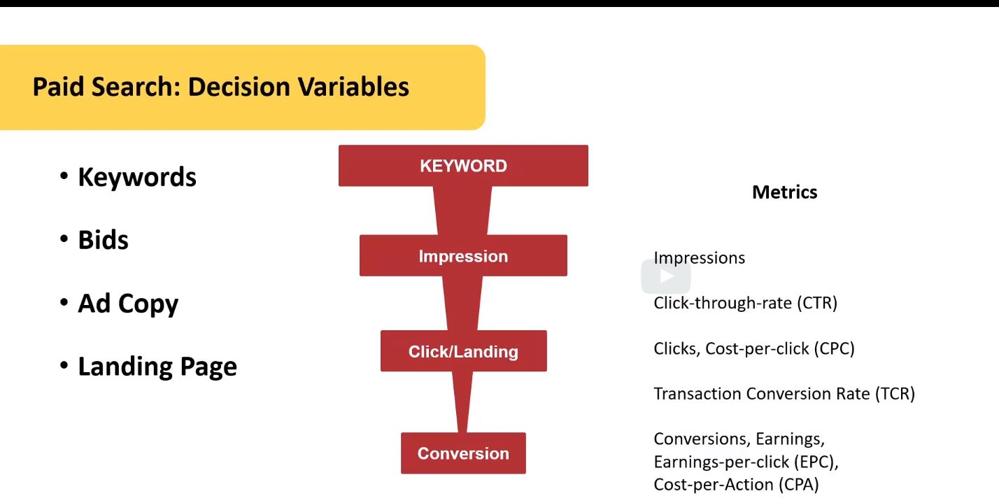

# Digital Marketing Analytics

## Introduction to Search Engine Optimization and Paid Search
**Search Engine Marketing**
- Is a type of online marketing that aims to establish a firm's visibility on search engines and bring prospective customers to the firm’s website.

**Paid Search**
- Is a form of search engine marketing that involves the promotion of websites by increasing their visibility in search engine results pages through paid advertising.

**Search Engine Optimization (SEO)**
- Is the process of improving a firm's visibility on search engines by optimizing content and design elements of the website,  inbound links, and various technical aspects of site performance.

## Analytics of SEO
### On-Page SEO
Is a practice of optimizing individual web pages including the content and HTML source code of a page. 
**Relevance to search intent**  
**Competitive intelligence:**
- other highly ranked keywords
- page organization
- content structure
- linkable content
- use third party tool as SEMRUSH

### Off-Page SEO 
Is any effort taken outside of a website including backlinks, online mentions, and social signals to improve its search engine rankings. 
Tools: MOZ
 
**Backlinks** 
- Volume
- Authority

### Technical SEO 
Is a practice of optimizing your website’s technical elements to ensure that search engines can crawl, index, and render your web pages correctly.
- Unique Content
- Site Structure and Navigation
- Site Speed - PageSpeed Insights

## Analytics of Paid Search
### Key Performance Indicator (KPI) or Metrics
- Click-through-rate (CTR)
- Clicks, Cost-per-click (CPC) 
- Transaction Conversion Rate (TCR) 
- Conversions
- Earnings
- Earnings-per-click (EPC)
- Cost-per-Action (CPA)
- Impressions 

